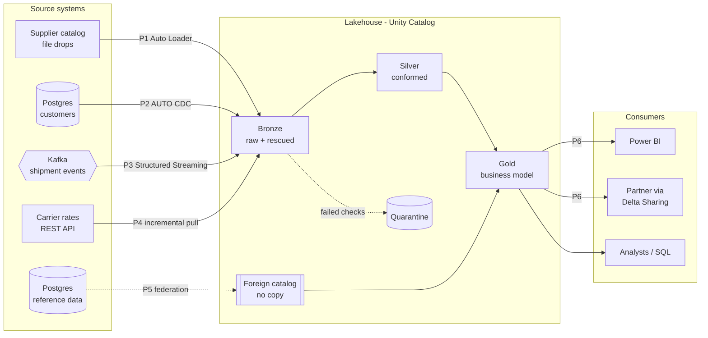
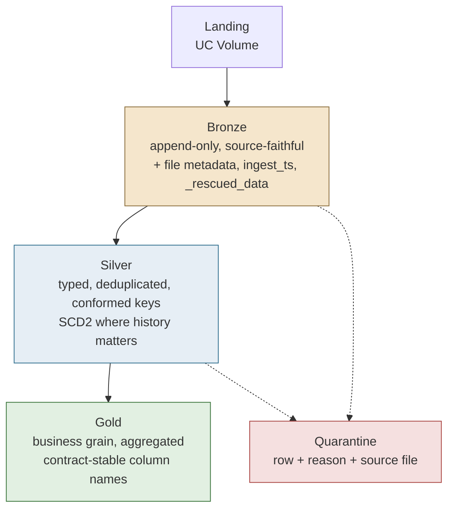
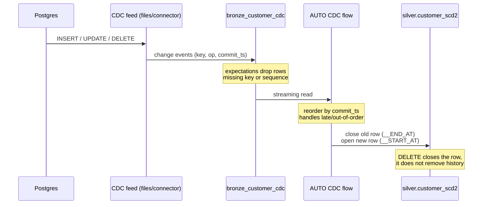
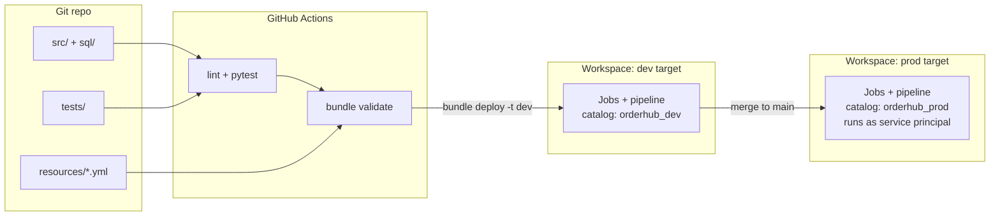
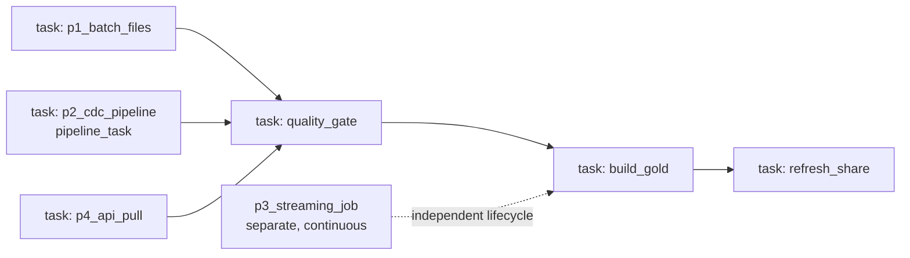

# Architecture Wireframes

Four views. In a client setting these are usually the artifact that gets circulated, so
they are deliberately kept at a level a delivery lead can read without a Databricks
background.

---

## 1. Context — the six patterns on one page

---

## 2. Layer contract — what each layer promises

Rule of thumb worth stating out loud in the review: bronze is never edited, silver is never
consumed directly by business users, gold never contains a column whose name would confuse
someone in finance.

---

## 3. Pattern P2 detail — CDC to SCD Type 2

The one pattern that always draws questions, so it gets its own diagram.

---

## 4. Deployment and orchestration

Orchestration inside the workspace:

P3 is deliberately a separate job. Putting an always-on stream inside a scheduled batch job
is the single most common orchestration mistake in this kind of build — it either blocks the
job forever or gets killed on every run.
